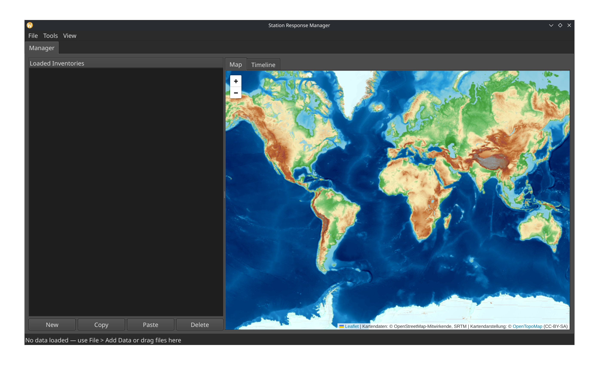
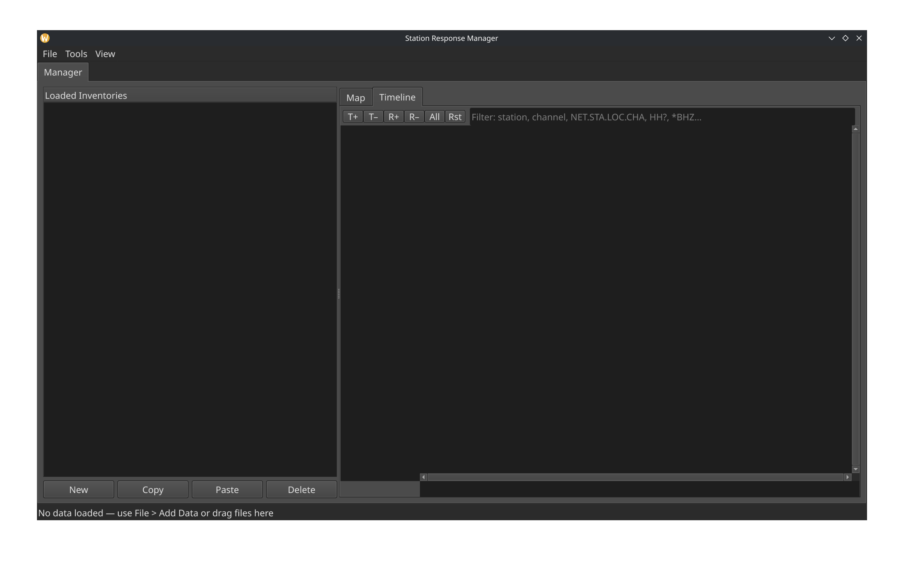

# Station Response Manager - Quick Start Guide

## Important (NRL)

- This project requires a local NRL folder to run.
- The NRL must be extracted (unarchived) as a normal directory tree, not kept as a .zip/.tar file.
- On startup, SRM first checks its default NRL path.
- If not found, it will prompt you to manually select the NRL folder.
- After a valid NRL is available, SRM initializes the NRL index.
	- If no index exists (or it is outdated), SRM builds/rebuilds it.
	- If an index is already valid, SRM loads it directly.
- If you cancel and no valid NRL is available, the app exits.

## 1. Launch

- Launch the app.

- Open data with File > Add Data (the whole folder), or drag and drop .xml/.dataless/.dless files into the main window.
- The first tab is always Manager.

## 2. Tweak UI a bit

- Open View and play a bit with the theme (Dark/Light, also works for the MPL resps now) and font size.

## 3. Understand the Manager Window Layout

In the Manager tab:

- Left side: Loaded Inventories tree.
	- Double-click a file item to open its Explorer tab.
	- Buttons under the tree: New, Copy, Paste, Delete - for doing high level maintenance at the file level.
- Right side: Two sub-tabs.
	- Map: station map view. Zooms to the station if the station is selected. Offline map works only for low level zoom.
	- Timeline: channel/station time coverage view.

<mark>Important: The Timeline is a tab inside Manager (right panel), not a top-level window tab. It is easy to miss.

## 4. Timeline Tab

Open Manager > Timeline to use the coverage timeline.

Key interactions:

- Double-click a timeline row to jump to that item in Explorer.
	- Station row opens the file in Explorer and selects the station.
	- Channel row opens the file in Explorer and selects the channel.
- Filter bar supports quick text and wildcard patterns.
	- Examples: BHZ, HH?, *BHZ, NET.STA.LOC.CHA

Timeline controls:

- T+ / T-: zoom time axis in/out.
- R+ / R-: show more/fewer rows.
- All: fit all rows and full time range.
- Rst: reset to default row count and view.
- Mouse wheel:
	- Ctrl + wheel adjusts visible row count.
	- Ctrl + Shift + wheel zooms time axis.

## 5. Explorer Tab (Metadata Editing)

Open an Explorer tab by:

- Double-clicking a file in Manager tree, or
- Double-clicking a row in Timeline.

In Explorer:

- Edit values directly in the Value column.
- Use top filters:
	- Filter by network/station.
	- Property filter.
- Use New/Delete to add or remove fields/items.
- Double-click the Response node under a channel to open the Response editor tab.

## 6. Response Tab

In Response tab:

- Left side: response tree editor.
- Right side: amplitude and phase plots (auto-updated).
- Buttons:
	- New: add response stage or poles/zeros entries.
	- Delete: remove selected stage/entry.
	- Replace Response: load response from NRL selection.
	- Revert Response: undo all changes made in this response tab.
- Double-click pole/zero values to edit complex values in a dialog.

## 7. Save Your Work

- Response and Explorer edits update objects in memory as you work.
- Use File > Save All Files to write all loaded inventories back to disk or Ctrl+S

## 8. Other Features

- Tools > Build Inventory:
	- Creates a new inventory via a wizard.
	- Can optionally start from a miniSEED file to pre-fill station/channel basics.
- Tools > Convert to XML:
	- Converts dataless/RESP input to StationXML output.

